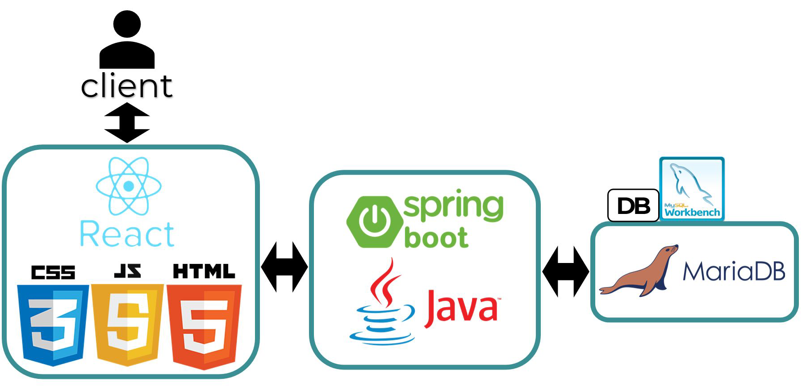

# KHUromise(쿠로미스):경희대학교 약속 플랫폼

 

> 2022년 경희대학교 SW중심대학 동아리 단합 공모전에 동아리 Hacker 소속 Team KHUromise로 참여했습니다.

## 프로젝트 소개
경희대학교 학생들의 코로나19로 단절된 선후배 관계 개선과 학생들간 만남을 이루게 해주는 서비스입니다.

## 기능
### 회원가입/회원탈퇴, 로그인/로그아웃
- 경희대학교 학생이라면 누구나 가입할 수 있어요. 학생 인증을 위해 경희대 이메일을 통해 인증메일을 받으실 수 있어요.

### 약속 잡기
- 누구나 내가 원하는 장소와 시간대, 날짜를 선택하고 약속을 등록해보세요.
- 각 게시물의 '신청하기' 버튼을 통해 약속에 참여할 수 있어요.
- 약속 참여자들간의 소통을 위해 댓글 기능을 이용해보세요.

### 약속 보기
- 카테고리별 게시판에서 다른 사람들의 약속을 확인하고 참여해보세요.

### 마이페이지
- 내 게시글, 댓글을 바로 확인하고 관리해보세요.
- 내가 참여한 약속을 확인하고 잊어버리지 마세요.

## 팀원 소개

### Frontend
|  이름  |                            역할                            |                  Github                   |
| :----: | :--------------------------------------------------------: | :---------------------------------------: |
| 변시윤 | 로그인/로그아웃, 게시글 작성/수정, 검색형 지도, 내위치지도 |  [바로가기](https://github.com/CUNIIII)   |
| 강경현 |    회원가입/회원탈퇴, 이메일 인증, 게시판, 게시물, 댓글    |  [바로가기](https://github.com/nageune)   |
| 박예림 |   메인페이지, 마이페이지, 내게시물, 내댓글, 내약속, CSS    | [바로가기](https://github.com/debora1628) |

### Backend
|  이름  |                   역할                    |                   Github                    |
| :----: | :---------------------------------------: | :-----------------------------------------: |
| 이천국 |        게시판 CRUD, 플로우 구성도         |  [바로가기](https://github.com/twoheaven)   |
| 권승원 | 로그인/로그아웃 구현, 신청 기능, API 설계 | [바로가기](https://github.com/SeungwonKwon) |
| 양동균 |            댓글 CRUD, API 설계            |   [바로가기](https://github.com/ydg1210)    |

## 아키텍쳐

## Tech Stack

### Frontend

### Backend

### Tools

